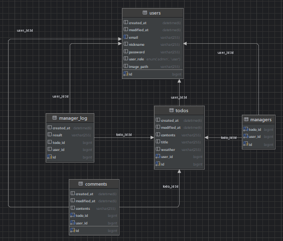

## 📆Spring Plus
### 일정을 `등록/조회/수정/삭제` 할 수 있는 웹페이지.

### 🗂️프로젝트 구조
<details><summary>프로젝트 구조(펼치기/접기)</summary>

```bash
'src.main.java.org.sample.export'           # spring-plus 프로젝트 관련 패키지와 소스 코드를 모아놓은 폴더 
 ├── 'aop'                                  # aop 관련 로깅 class들을 모아놓은 폴더
 ├── 'api'                                  # 외부 api와 통신하는 class들을 모아놓은 폴더
 │    └── 'dto'                              
 ├── 'config'                               # 프로젝트 설정 관련 class들을 모아놓은 폴더
 ├── 'domain'                               # 도메인 모델을 정의하는 class들을 모아놓은 폴더
 │    ├── 'auth'                            # 로그인 & 회원가입 관련 폴더와 class들을 모아놓은 폴더                              
 │    │   ├── 'controller'                     
 │    │   ├── 'dto'                     
 │    │   ├── 'exception'                     
 │    │   └── 'service'                     
 │    ├── 'comment'                         # 댓글 관련 폴더와 class들을 모아놓은 폴더                                 
 │    │   ├── 'controller'           
 │    │   ├── 'dto'                  
 │    │   ├── 'entity'               
 │    │   ├── 'repository'           
 │    │   └── 'service'              
 │    ├── 'common'                          # 공통으로 사용되는 class들을 모아놓은 폴더        
 │    │   ├── 'dto'                  
 │    │   ├── 'entity'               
 │    │   └── 'exception'            
 │    ├── 'manager'                         # 일정 담당자 관련 class들을 모아놓은 폴더              
 │    │   ├── 'controller'           
 │    │   ├── 'dto'                  
 │    │   ├── 'entity'               
 │    │   ├── 'repository'           
 │    │   └── 'service'              
 │    ├── 'todo'                            # 일정 관련 class들을 모아놓은 폴더                    
 │    │   ├── 'controller'           
 │    │   ├── 'dto'                  
 │    │   ├── 'entity'               
 │    │   ├── 'repository'           
 │    │   └── 'service'              
 │    └── 'user'                            # 유저 관련 class들을 모아놓은 폴더                  
 │        ├── 'controller'           
 │        ├── 'dto'                  
 │        ├── 'entity'               
 │        ├── 'repository'           
 │        └── 'service'                      
 ├── 'filter'                               # 필터들을 모아놓은 폴더
 ├── 'security'                             # security관련 class들을 모아놓은 폴더
 └── 'util'                                 # 공통적으로 사용할 수 있는 유틸리티 class들을 모아놓은 폴더
```
</details>

### 📑ERD
<details><summary><b>ERD (펼치기/접기)</b></summary>

</details>

### 📋AWS
<details><summary>AWS 설정 화면 캡쳐(펼치기/접기)</summary>

### EC2
#### Instance


#### Security


#### Elastic IP


### RDS
#### Database


#### Configuration


#### Security


#### Parameter Group


### S3
#### Buckets


#### Permissions


### AIM
#### User


</details>

### 🗂️대용량 데이터 처리
|방법|시도 횟수|소요 시간|
|---|---|---|
|기본 `JPA`방식|100|`3min 51sec`|
|`password` 컬럼을 조회에서 제외|100|`3min 2sec`|
|`nickname`컬럼에 인덱싱|100|`10ssec 67ms`|
|`nickname`컬럼에 인덱싱 & `password` 컬럼을 조회에서 제외|100|`11sec 181ms(?)`|

#### 결론
- 크기가 크거나 특정 상황 때 필요한 컬럼은 제외하면 조회 속도가 향상된다.
- 자주 사용하는 컬럼에 인덱스를 걸면 조회 속도가 향상된다.
- **왜인지 이 둘을 혼용하면 조회 속도가 더 떨어진다.**

### 🖥️개발환경
- `Window 11`
- `JDK 1.8`
- `DataBase - MySQL`
- `PostMan`
- `AWS`
    - `EC2`
    - `RDS`
    - `S3`

### 💫Denpendencies
- `Lombok`
- `Spring Web`
- `Spring Security`
- `JDBC API`
- `Spring Data JPA`
- `MySQL Driver`
- `Validation`
- `CycloneDX SBOM support`

### 🔨개발 툴
- `Intellij`

### 🧑‍💻사용언어
- `Java`
- `Kotlin`